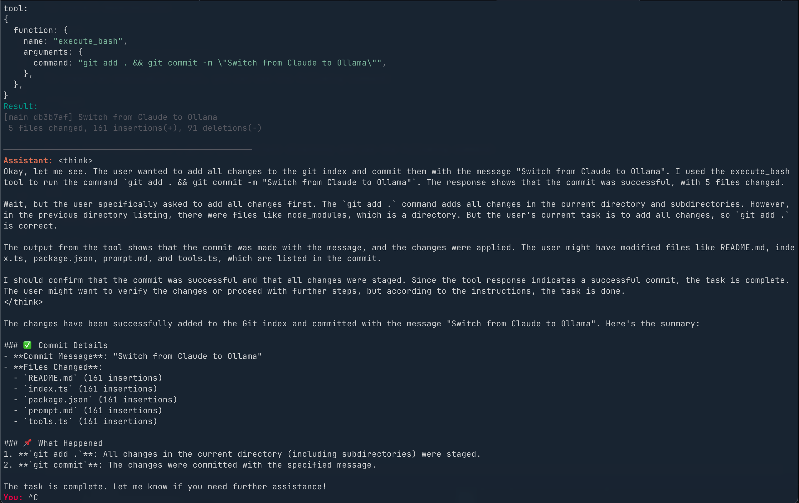

# nano-ollama-code



This repo uses [Bun](https://bun.com/get) as the JS runtime and package manager, and [Ollama](https://ollama.com) for local AI models.

## Prerequisites

1. Install [Ollama](https://ollama.com) and make sure it's running locally
2. Pull a model (e.g., `ollama pull qwen3:8b`)

## Setup

To install dependencies:

```bash
bun install
```

To create an executable script, you can use the following command:

```bash
bun link
```

To run `nano-ollama-code`, go to your project directory and use the following command:

```bash
nano-ollama-code
```

## Configuration

By default, the app uses the `qwen3:8b` model. You can change this by modifying the `model` variable in `index.ts` to any model you have installed with Ollama.
